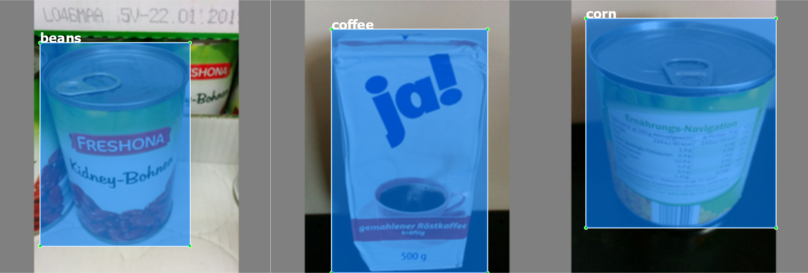

# 5K Groceries Dataset for Object Detection

The dataset is an extended version of the [Freiburg Groceries Dataset](http://aisdatasets.informatik.uni-freiburg.de/freiburg_groceries_dataset/). The original dataset can be found [here](https://github.com/PhilJd/freiburg_groceries_dataset). It consists of 4947 images across 25 classes. All of the images are scaled down to 224x224x3. This repository extends the original dataset by providing labeled bounding boxes for each of the available images.

**In the `train-val` branch there is a seperation of the dataset in training and validation splits.**

The annotations in the PascalVOC format. They are made with the [labelimg Labeling Tool.](https://github.com/tzutalin/labelImg)

All credit goes to the respective authors.

